# Interaction: Ranking Engine vs. Audit System

This document visualizes how the Ranking System (Sorting) and Audit System (Verification) interact without creating conflicts.

## Workflow Visualization

```mermaid
sequenceDiagram
    participant User
    participant System2 as Ranking Engine (Sort)
    participant UI as News List (Render)
    participant System3 as Audit System (Verify)

    User->>System2: Fetches News

    note over System2: 1. Calculate Scores<br/>2. Cluster & Deduplicate<br/>3. Sort List (Date or Score)

    System2->>UI: Returns Sorted List
    activate UI
    UI-->>User: Displays Articles (No Badges yet)
    deactivate UI

    note right of UI: User sees content immediately.<br/>Interaction is snappy.

    System2->>System3: Triggers Audit (Async / 3s Delay)
    activate System3

    note over System3: 1. Count Sources (Consensus)<br/>2. Check History (Persistence)<br/>3. Match Keywords (Relevance)<br/>4. Check Anomalies (Stats)

    System3->>UI: Returns Badges {id: '⚡', id: '🎯'}
    deactivate System3

    activate UI
    UI-->>User: Updates Articles with Badges (Pop-in)
    deactivate UI

    note right of UI: Badges appear as "Verified"<br/>metadata. Order does NOT change.
```

## Conflict Resolution

*   **Sorting vs. Badging**: The Ranking Engine (System 2) is solely responsible for the **order** of stories. The Audit System (System 3) is solely responsible for **annotating** stories with extra context.
*   **Performance**: By running System 3 asynchronously, we avoid delaying the initial render. The "pop-in" effect of badges acts as a visual confirmation of verification.
*   **Feedback Loop**: Currently, System 3 does **not** feed back into System 2 during the same session. This prevents infinite loops or unstable sorting where badges appear and disappear.
